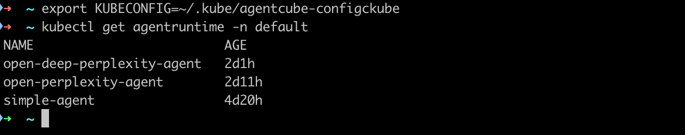
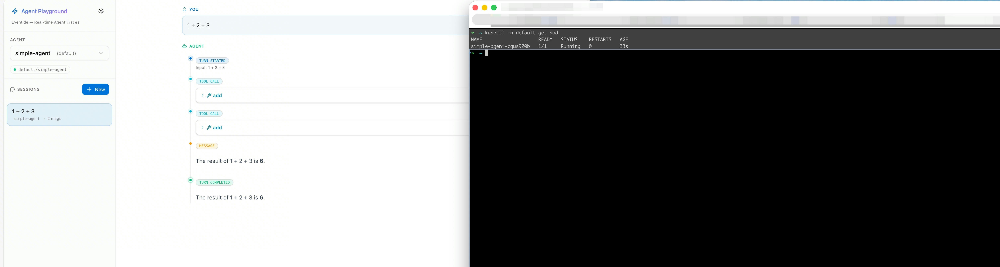
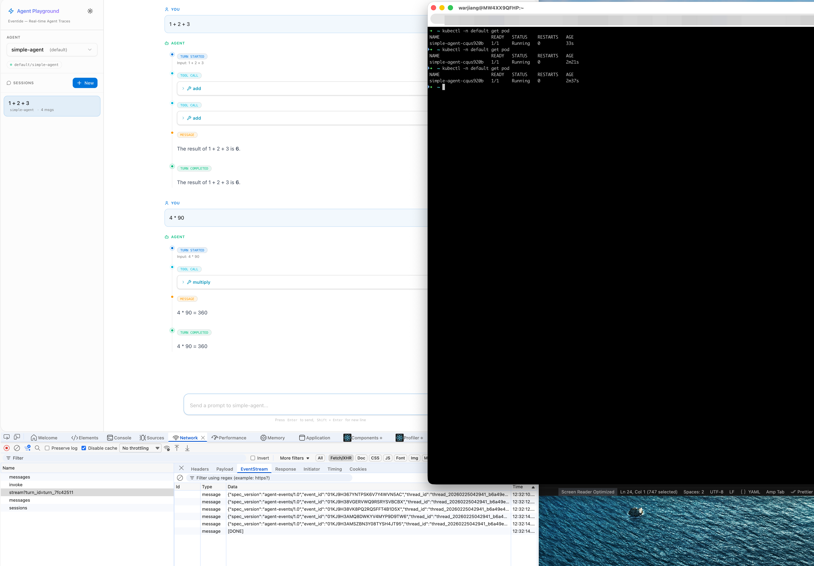

# Simple Agent 案例

本指南将通过一个简单的 ReAct 案例，完整的介绍一个agent应该如何开发、发布到 AgentCube 上并通过 playground 调用。


## Agent 开发

初始化一个agent目录，目录结构如下：

```
simple-agent/
├── agent.py
├── Dockerfile
├── main.py
├── pyproject.toml
├── README.md
├── agent_metadata.yaml
└── uv.lock
```

- `agent.py`：agent的主要逻辑代码，可以选用任何你熟悉的Agent框架，甚至支持手搓。
- `main.py`：AgentRuntime的入口文件，用于启动agent，考虑到实际交互场景，推荐使用http server来启动，等待用户请求。
- `Dockerfile`：用于构建agent的Docker镜像。
- `pyproject.toml`：Python项目的配置文件，用于管理依赖和构建。
- `uv.lock`：Python依赖的锁定文件，用于确保依赖的一致性。
- `agent_metadata.yaml`：agent 的元数据文件主要给 AgentCube 系统使用，用于描述agent的基本信息，如名称、版本、描述等。
- `README.md`：agent 的说明文档。


## Agent 发布

> 目前不推荐走 AgentCube 提供的 `kubectl agentcube pack` 来打包 agent，建议可以手动打包，速度更快

一个合法的 `agent_metadata.yaml` 文件如下, 在当前目录下创建 `agent_metadata.yaml` 文件


```yaml
agent_name: simple-agent
language: python
entrypoint: python main.py
port: 8080
build_mode: cloud
image:
  repository_url: {repository_url}
requirements_file: requirements.txt
registry_url: {private_registry_url}
registry_username: {registry_username}
registry_password: {registry_password}
agent_endpoint: http://localhost:18081
workload_manager_url: http://workloadmanager.agentcube.svc:8080
router_url: http://agentcube-router.agentcube.svc:8080
readiness_probe_path: /health
readiness_probe_port: 8080
agent_id: simple-agent
k8s_deployment:
  deployment_name: simple-agent
  namespace: default
  status: deployed
  type: AgentRuntime

```

执行下面的命令发布Agent到 AgentCube 系统中：

```shell
uv add agentcube-cli kubernetes
export KUBECONFIG=~/.kube/agentcube-config
kubectl agentcube publish --provider agentcube -f . --verbose
```

发布完成后执行 `kubectl get agentruntime -n default` 可以看到系统中会多一个AgentRuntime的资源：




执行 `kubectl get agentruntime simple-agent -n default -o yaml` 可以看到AgentRuntime资源的详细信息：

```yaml
apiVersion: runtime.agentcube.volcano.sh/v1alpha1
kind: AgentRuntime
metadata:
  annotations: {}
  creationTimestamp: "2026-02-20T06:57:56Z"
  generation: 36
  labels:
    app: simple-agent
  name: simple-agent
  namespace: default
  resourceVersion: "1016557"
  uid: 4854498f-2809-47b3-888c-98d6237a2aa3
spec:
  maxSessionDuration: 8h
  podTemplate:
    spec:
      containers:
      - args:
        - main.py
        command:
        - python
        env:
        - name: WORKLOAD_MANAGER_URL
          value: http://workloadmanager.agentcube.svc:8080
        - name: ROUTER_URL
          value: http://agentcube-router.agentcube.svc:8080
        - name: EVENT_GATEWAY_URL
          value: http://eventide-gateway.eventide.svc.cluster.local:18081
        image: simple-agent:0.0.17
        imagePullPolicy: IfNotPresent
        name: runtime
        ports:
        - containerPort: 8080
          name: http
          protocol: TCP
        readinessProbe:
          httpGet:
            path: /health
            port: 8080
          initialDelaySeconds: 3
      imagePullSecrets:
      - name: default-secret
      restartPolicy: Always
  sessionTimeout: 15m
  targetPort:
  - pathPrefix: /
    port: 8080
    protocol: HTTP
```

## Agent 调用

1. 通过 kubectl 插件调用
    ```shell
    kubectl agentcube invoke -f  . --payload '{"prompt": "1+2*3"}' --verbose
    ```

2. 通过 HTTP 调用
    ```shell
    curl -v -X POST http://agentcube-router.agentcube.svc:8080/v1/namespaces/default/agent-runtimes/simple-agent/invocations/runcmd \ 
        -H "Content-Type: application/json" \
        -d '{"payload": {"prompt": "what is 1+2+3?"}}'
    ```
3. 通过 AgentCube sdk 调用(WIP 待PR合并):
    ```python
    from agentcube import AgentRuntimeClient

    # first time: it will create a new pod
    agent_client_v1 = AgentRuntimeClient(
        agent_name="my-agent",
        router_url="http://localhost:18081",
        namespace="default",
        verbose=True,
    )
    print(agent_client_v1.session_id)

    result_v1 = agent_client_v1.invoke(
        payload={"prompt": "Hello World!"},
    )
    print(result_v1)

    # second time: it will try to reuse the pod created before
    agent_client_v2 = AgentRuntimeClient(
        agent_name="my-agent",
        router_url="http://localhost:18081",
        namespace="default",
        session_id=agent_client_v1.session_id,
        verbose=True,
    )
    # same with the first time
    print(agent_client_v2.session_id)

    result_v2 = agent_client_v2.invoke(
        payload={"prompt": "Hello World!"},
    )
    print(result_v2)
    ```
4. 通过 Eventide Playground 调用:
    ```shell
    export KUBECONFIG=~/.kube/agentcube-config
    kubectl port-forward -n eventide svc/eventide-playground 28000:8000
    ```
    
    打开浏览器访问 `http://localhost:28000`，可以看到 Playground 界面，切换刚刚发布的 `simple-agent` ：
    
    

    第一次执行的时候会自动拉起一个新的pod，后续的调用会尝试复用这个pod，减少冷启动时间：

    

    第二次执行的时候不会重新创建pod，而是直接调用已经存在的pod:
    
    