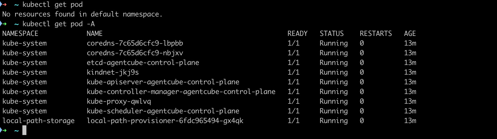
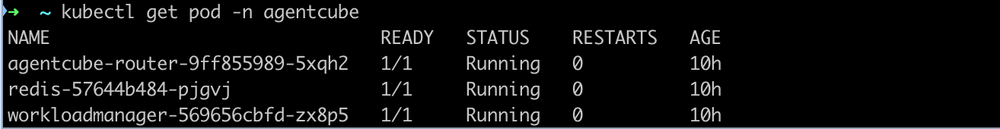

# Eventide 安装

本指南将帮助你快速搭建 Lumina Scheduler 环境。

## 环境准备

### 1. 安装系统依赖

#### Linux 系统配置

```bash
# 提升 fd 上限
sudo sysctl fs.inotify.max_user_watches=1255360
```

#### 安装 Kind 和 Kubectl

```bash
TBD
```

### 2. 初始化 Docker

确保 Docker 已启动，并创建 `docker-config.json` 文件用于镜像拉取。
`docker-config.json` 内容如下：

```json
{
  "auths": {
    "${your-registry-domain}": {
      "auth": "base64(${your-username}:${your-password})"
    }
  }
}
```


### 3. 创建 Kind 集群

```shell
# 创建 agentcube 集群
cat <<EOF | kind create cluster --name=agentcube --config=-
kind: Cluster
apiVersion: kind.x-k8s.io/v1alpha4
networking:
  apiServerAddress: "0.0.0.0"
nodes:
- role: control-plane
  image: kindest/node:v1.31.4
  extraMounts:
  - containerPath: /var/lib/kubelet/config.json
    hostPath: /path/to/docker-config.json
EOF
```

### 4. 配置 kubeconfig

```shell
# 导出集群配置
kind get kubeconfig --name agentcube > ~/.kube/agentcube-config

# 从远程机器复制配置
scp ${remote-machine}:~/.kube/agentcube-config ~/.kube/
```

修改 `agentcube-config` 配置文件：

```yaml
apiVersion: v1
clusters:
- cluster:
    insecure-skip-tls-verify: true
    server: https://192.168.16.8:33767
  name: kind-agentcube
contexts:
- context:
    cluster: kind-agentcube
    user: kind-agentcube
  name: kind-agentcube
current-context: kind-agentcube
kind: Config
users:
- name: kind-agentcube
```

### 5. 验证集群

```bash
export KUBECONFIG=~/.kube/agentcube-config
kubectl get pod -A
```

如果正常可以看到如下结果：



## 安装 AgentCube

### 1. 安装 Agent-Sandbox

```bash
AGENT_SANDBOX_VERSION=v0.1.1
wget https://github.com/kubernetes-sigs/agent-sandbox/releases/download/${AGENT_SANDBOX_VERSION}/manifest.yaml
wget https://github.com/kubernetes-sigs/agent-sandbox/releases/download/${AGENT_SANDBOX_VERSION}/extensions.yaml

kubectl apply -f manifest.yaml
kubectl apply -f extensions.yaml
```

验证安装：

```bash
kubectl get pod -n agent-sandbox-system
```

如果正常可以看到如下结果：


### 2. 创建 agentcube 命名空间

```bash
kubectl create namespace agentcube
```

### 3. 部署 Redis

```bash
kubectl -n agentcube create deployment redis --image=redis:7-alpine --port=6379
kubectl -n agentcube expose deployment redis --port=6379 --target-port=6379
kubectl -n agentcube rollout status deployment/redis
```

### 4. 安装 AgentCube

```bash
git clone https://github.com/volcano-sh/agentcube.git
cd agentcube

helm upgrade --install agentcube ./manifests/charts/base \
    --namespace agentcube \
    --create-namespace \
    --set redis.addr="redis.agentcube.svc.cluster.local:6379" \
    --set redis.password="''" \
    --set router.rbac.create=true \
    --set router.serviceAccountName="agentcube-router"
```

会安装如下三个资源

- AgentCube CRDs (`CodeInterpreter`, `AgentRuntime`)
- Workload Manager deployment
- AgentCube Router deployment

执行 `kubectl get pods -n agentcube`验证：




### 5. 安装 Eventide

```
git clone git@github.com:warjiang/eventide.git
cd charts
# 在eventide目录下创建values-onpremise.yaml
helm upgrade --install eventide ./eventide -f ./eventide/values-onpremise.yaml -n eventide --create-namespace
```

`values-onpremise.yaml` 内容参考如下：

```yaml
nameOverride: ""
fullnameOverride: ""

imagePullSecrets: []

secrets:
  create: true

config:
  redis:
    addr: ""
    username: ""
    password: ""
    db: 0

  postgres:
    connString: ""

  s3:
    endpoint: ""
    region: "us-east-1"
    bucket: "eventide"
    accessKeyID: "eventide"
    secretAccessKey: "eventide"
    prefix: "eventide"
    usePathStyle: true

  streams:
    trimMaxLen: 100000

gateway:
  enabled: true
  replicaCount: 1
  image:
    repository: ghcr.io/warjiang/eventide/gateway
    tag: "latest"
    pullPolicy: IfNotPresent
  service:
    type: ClusterIP
    port: 18081
  resources: {}

beacon:
  enabled: true
  replicaCount: 1
  image:
    repository: ghcr.io/warjiang/eventide/beacon
    tag: "latest"
    pullPolicy: IfNotPresent
  service:
    type: ClusterIP
    port: 18082
  resources: {}

persister:
  enabled: true
  replicaCount: 1
  image:
    repository: ghcr.io/warjiang/eventide/persister
    tag: "latest"
    pullPolicy: IfNotPresent
  tenantID: "default"
  idleTimeoutSeconds: 900
  group: "persist"
  consumer: ""
  dlqStream: "stream:global:dlq"
  maxRetries: 5
  resources: {}

referenceAgent:
  enabled: true
  replicaCount: 1
  image:
    repository: ghcr.io/warjiang/eventide/reference-agent
    tag: "latest"
    pullPolicy: IfNotPresent
  service:
    type: ClusterIP
    port: 18080
  resources: {}

playground:
  enabled: true
  replicaCount: 1
  serviceAccount:
    create: true
    name: ""
  image:
    repository: ghcr.io/warjiang/eventide/playground
    tag: "latest"
    pullPolicy: IfNotPresent
  service:
    type: ClusterIP
    port: 18083
  resources: {}

migrate:
  enabled: true
  image:
    repository: ghcr.io/warjiang/eventide/migrate
    tag: "latest"
    pullPolicy: IfNotPresent

archiver:
  enabled: false
  image:
    repository: ghcr.io/warjiang/eventide/archiver
    tag: "latest"
    pullPolicy: IfNotPresent
  schedule: ""
  threadID: ""
  fromSeq: 1
  toSeq: 0

postgresql:
  enabled: true
  auth:
    username: eventide
    password: eventide
    database: eventide
  primary:
    persistence:
      enabled: true
      size: 8Gi

redis:
  enabled: true
  auth:
    enabled: false
    password: ""
  master:
    persistence:
      enabled: true
      size: 8Gi

seaweedfs:
  enabled: true
  image:
    repository: chrislusf/seaweedfs
    tag: "4.02"
    pullPolicy: IfNotPresent
  persistence:
    enabled: true
    size: 20Gi
    storageClassName: ""
  service:
    type: ClusterIP
    ports:
      master: 9333
      volume: 8080
      public: 8888
      s3: 8333

```


## 下一步

- 查看 [API 参考](./api-reference)
- 了解 [事件类型](./event-types)
