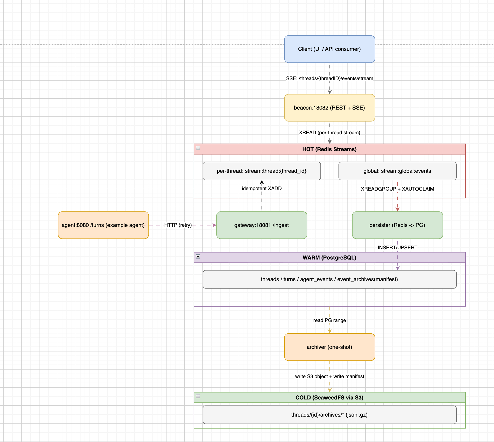

# Eventide

Eventide 通过 Event 解耦 Agent 运行时和消费端， 支持多语言、异构 Agent 框架将 Agent 运行时的事件暴露出来，供终端（比如 Web 前端、IM 端）消费。

## 核心特性

- **支持海量事件**：提供热（redis-stream）、温（postgresql）、冷（s3兼容存储）事件存储，支持海量事件的实时处理和查询
- **多语言支持**：支持Python、GO、JavaScript(开发中) 等多语言的SDK接入
- **异构 Agent 框架支持**：支持多种 Agent 框架，如 LangGraph、CrewAI 等主流 Agent 框架

## 架构概览

> eventide主要解决了两个问题：
> 1. 如何运行的agent把执行过程暴露出来
> 2. 如何解决大量event消费、持久化问题

event 天然是解耦复杂的一种形式，通过event的方式，可以解耦执行和消费的过程，结合我们的场景，其实就是前端和后端无需关注彼此，只需要为事件负责即可，Agent研发任务负责按照spec生产event，前端负责根据对应的event生成对应的可交互UI即可。开发Agent的过程中可能会有不同的编程语言、不同的framework，我们希望设计一套可复用的event spec,支持现有和未来可能产生的新需求。agent在执行过程中会生成大量的event，为了解决兼顾event的实时消费和冷备的需求，增加了 hot/warm/cold 三层存储，应对未来可能存在的event膨胀的问题。整体eventide结构：




## 用法概览

### 安装依赖
```
pip install eventide-sdk
```

### 运行 Agent & 写入事件

```python
from eventide import GatewayClient, Event, EventType, Level

GATEWAY_URL = os.getenv("EVENT_GATEWAY_URL", "http://127.0.0.1:18081")
client = GatewayClient(GATEWAY_URL)

async for chunk in agent.astream({
    "messages": [HumanMessage(content=prompt)],
    "llm_calls": 0,
}):
    for node_name, node_output in chunk.items():
        messages = node_output.get("messages", [])
        for last_message in messages:
            # 处理消息
            pass
```

## 下一步

- 查看 [Getting Started](./getting-started) 安装指南
<!-- - 了解 [Agent 配置](./agent-config) -->
